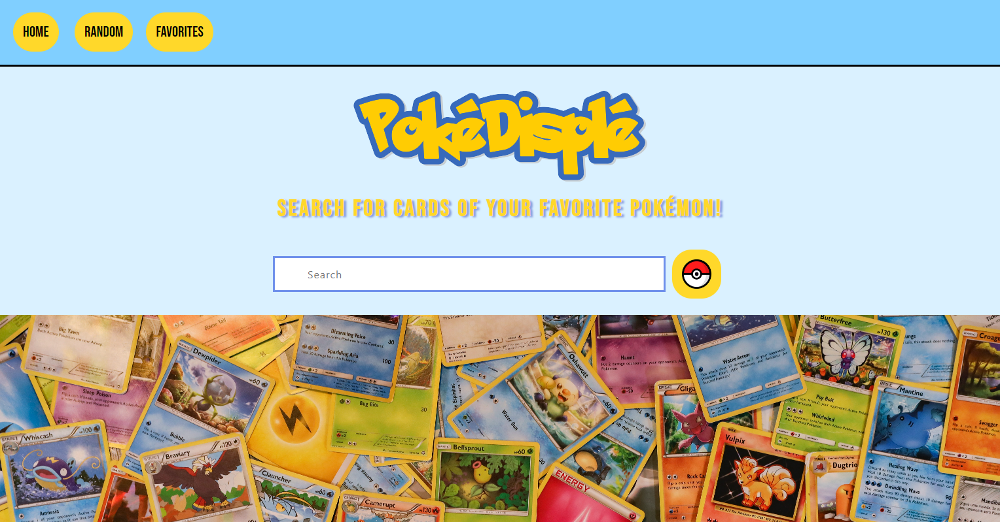

# Project 1 - Interactive Front-End Application - PokéDisplé

## Description

This website was created as a group project for the University of Richmond coding boot camp. The task was to work together to create a web application fitting a user story that the group decided on, using at least two server-side APIs, a CSS framework other than Bootstrap, and local storage functionality, among other requirements. To that end, we created a Pokémon card search application that allows you to search for Pokémon cards, pull up a random card, and even create a list of favorite cards. While working on this project, we discovered the benefits and costs of working collaboratively with code, the limitations of using APIs you cannot control, and the coordination required to successfully use Git branches and merges.

## Installation

N/A

## Usage

Visit the website at https://madchazo.github.io/P1-pokedisple/.

There are three pages to the site: Home, Random, and Favorites. The random page will show you a card from a random Pokémon and give you some information about it, including the average Cardmarket sell price. (You may also see an Easter egg or two if you're lucky!) The favorites page will display a list of your favorite cards as selected using the search function on the homepage. The homepage allows you to search and displays a list of card images of the results - as well as a sprite if your search matches the name of a Pokémon.

### Search instructions

Unfortunately, due to the limitations of the APIs we used, you cannot search for Pokémon with a space in their name, such as "Mr. Mime". To find those Pokémon, we recommend searching for one word of the name, such as "Mime."

You may, however, search part of a name and find all Pokémon with that part in their name using an asterisk (\*). For example, searching "Char\*" will pull up cards for "Charmander," "Charmeleon," and "Charizard," and searching "\*chu" will pull up cards for "Pichu," "Pikachu," and "Raichu."

The search function will pull up a maximum of 250 cards. 

## Credits

The creators of this project are:

J: https://github.com/ChasingGatsby

Madison: https://github.com/MadChazo

Ava: https://github.com/afj511

We used the [Bulma](https://bulma.io/) CSS framework for a portion of our styling. The APIs we used were [PokéAPI](https://pokeapi.co/) and the [Pokémon TCG API](https://pokemontcg.io/). We are very grateful to the contributors to those resources for their ease of use and comprehensive documentation.

The background image we used is a photo by [Mick Haupt](https://unsplash.com/@rocinante_11?utm_content=creditCopyText&utm_medium=referral&utm_source=unsplash) on [Unsplash](https://unsplash.com/photos/KtTF68ZjBak?utm_content=creditCopyText&utm_medium=referral&utm_source=unsplash).

## License

This project is under an MIT license. For more details, see the LICENSE file in the repository.
